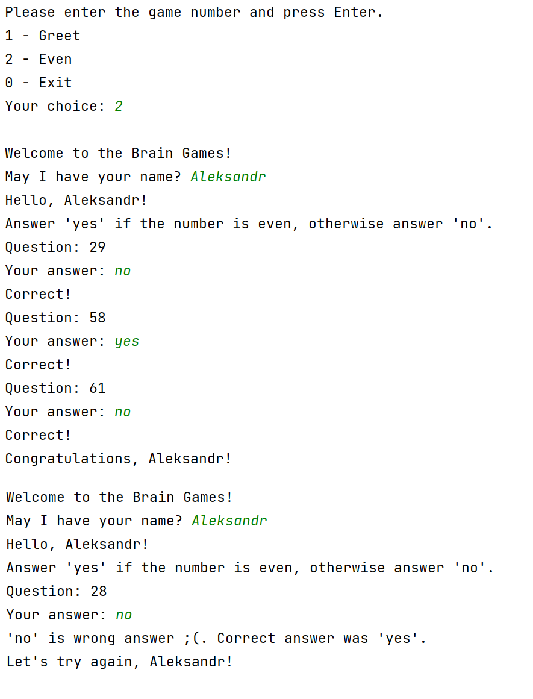
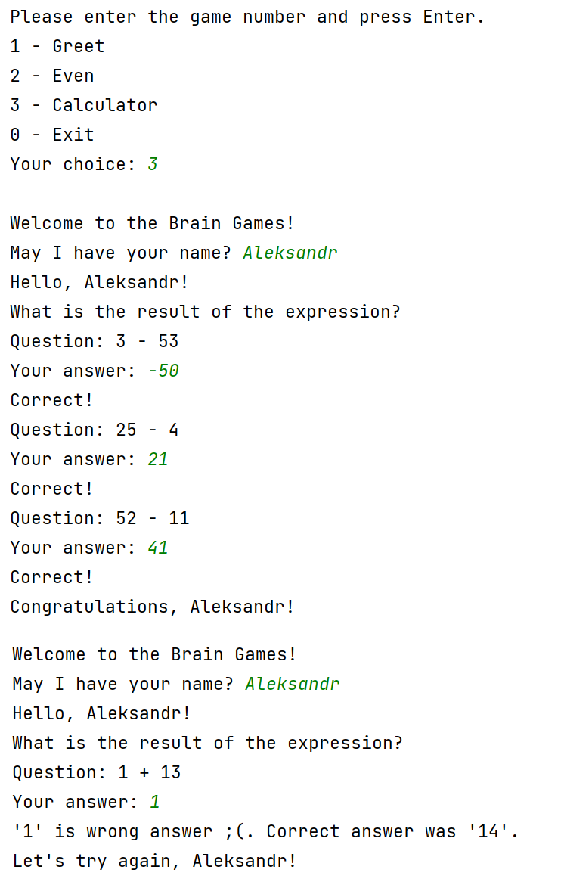
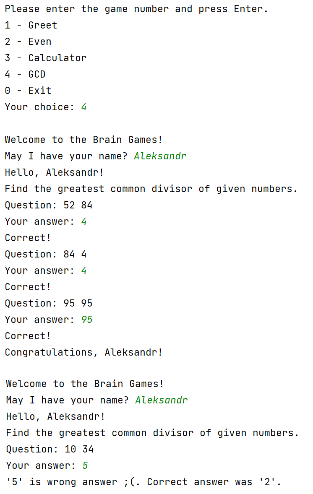
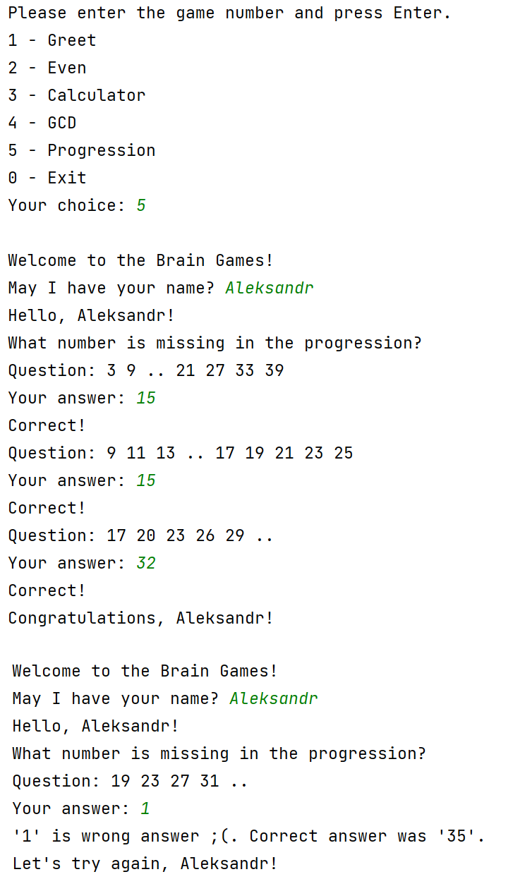
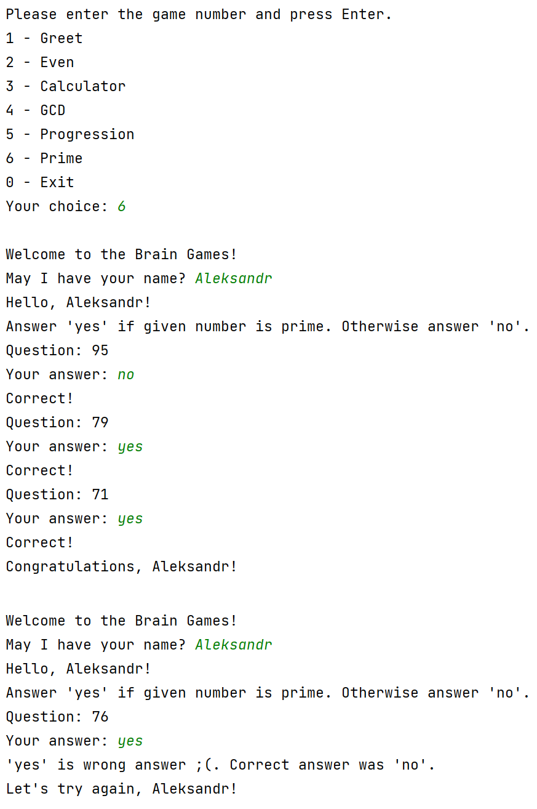

### Hexlet tests and linter status:
[](https://github.com/befayer/java-project-61/actions)

[](https://codeclimate.com/github/befayer/java-project-61/maintainability)
# Brain games

- Even. Answer "yes" if even. Otherwise, answer "no".
- Calculator. Correctly add, subtract or multiply.
- GCD. Greatest common divisor.
- Progression. Find a pattern.
- Prime. Answer "yes" if natural. Otherwise, "no".

## How to Run
```sh
   make run-dist
```

## Gameplay

### Even game


### Calculator game


### GCD game


### Progression game


### Prime game
